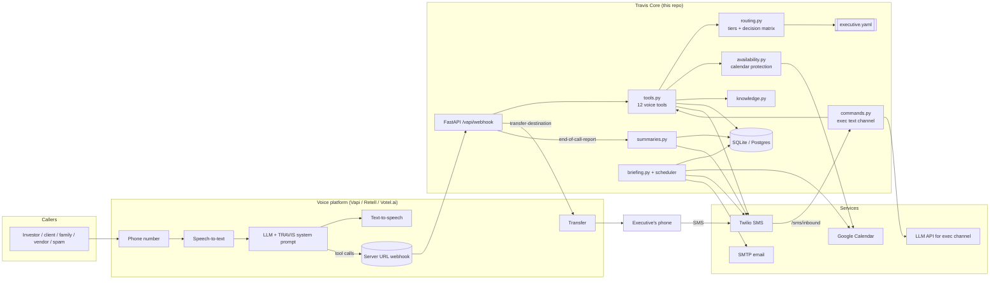

# 01 · Architecture

## Components



## Request lifecycle: one call

```mermaid
sequenceDiagram
  autonumber
  participant Caller
  participant Vapi as Voice platform
  participant Core as Travis Core
  participant Cal as Calendar
  participant Exec as Executive (SMS/phone)

  Caller->>Vapi: Dials the executive's number
  Vapi->>Core: assistant-request (optional, dynamic mode)
  Core-->>Vapi: assistantId + variables (time, exec status, greeting)
  Vapi->>Caller: "Good afternoon, Jordan Hale's office. This is TRAVIS."
  Vapi->>Core: tool-calls: lookup_caller
  Core-->>Vapi: tier=vip, name=Catherine Blake, notes
  Caller->>Vapi: "Is he available? It's about the term sheet."
  Vapi->>Core: tool-calls: route_call(reason, urgency=high)
  Core->>Cal: what's happening now?
  Cal-->>Core: Board meeting 1–3 PM (no-interrupt)
  Core->>Exec: SMS "HIGH: Catherine Blake on the line re term sheet"
  Core-->>Vapi: action=offer_callback, callback_time=3:15 PM
  Vapi->>Caller: "He's in a meeting until three. I've flagged this as urgent; he'll call you at 3:15."
  Vapi->>Core: tool-calls: take_message(...)
  Core->>Exec: SMS full message (high priority)
  Caller->>Vapi: hangs up
  Vapi->>Core: end-of-call-report (summary, structured data, transcript)
  Core->>Core: store call, create follow-ups
```

For a transfer, step 12 returns `action=transfer_exec`; the model calls the built-in `transfer_call` tool with no destination; the platform sends `transfer-destination-request`; Core answers with the number chosen by the routing decision. **The phone number never enters the model's context**, so no prompt injection can extract it.

## Why a separate backend at all?

You can build a simple receptionist with nothing but a prompt and platform-native tools. TRAVIS needs a backend because:

- **Routing must be deterministic.** "Family can interrupt, except during board meetings, unless critical" is three lines of code and a nightmare in a prompt.
- **Calendar protection must be enforced.** A prompt that says "never book over lunch" gets talked out of it eventually. Code doesn't.
- **Secrets must stay out of the model.** Executive mobile, team numbers, private notes.
- **State outlives a call.** Memory, follow-ups, the briefing and the text channel all need a database.
- **Portability.** The same backend works behind Vapi, Retell, Votel.ai or a self-hosted stack. Switch platforms by changing the adapter, not the logic.

## Module map

| File | Responsibility |
|---|---|
| `main.py` | HTTP endpoints, Vapi message dispatch, Twilio inbound, scheduler |
| `settings.py` | Environment config; demo-mode defaults |
| `profile.py` | Loads `executive.yaml`; phone normalization; time helpers |
| `routing.py` | `classify_caller` → tier; `assess_urgency`; `match_team`; `decide` → action |
| `calendar/availability.py` | `is_slot_valid`, `find_slots`, `executive_status` |
| `calendar/google.py`, `calendar/demo.py` | Calendar backends behind one interface |
| `tools.py` | The 12 voice tools + per-call state |
| `exec_tools.py` | Executive-only tools (move, block, cancel with PIN, recall…) |
| `commands.py` | Executive text channel: LLM tool loop + rule-based fallback |
| `briefing.py` | Morning briefing, evening-before attendee reminders |
| `summaries.py` | End-of-call processing |
| `knowledge.py` | Keyword search over markdown, hides `[CONFIDENTIAL]` sections |
| `notify.py` | SMS/email with demo fallback and outbox log |
| `security.py` | Vapi secret, Twilio signature, admin token |
| `db.py` + `database/schema.sql` | Storage |

## Data model

```mermaid
erDiagram
  contacts ||--o{ calls : "caller_phone"
  calls ||--o{ messages : "call_id"
  calls ||--o{ followups : "related_call_id"
  calls ||--o{ actions : "call_id"
  contacts { text name; text phone; text tier; int call_count }
  calls { text call_id; text tier; text priority; text outcome; text summary }
  messages { text for_key; text priority; text status }
  followups { text title; text owner_key; text due_at; text status }
  memories { text subject; text fact; text visibility }
  actions { text actor; text action; text detail }
  outbox { text channel; text recipient; text status }
  events { text title; text start; text end; text kind }
```

## Latency budget (voice loop)

| Step | Target |
|---|---|
| Endpointing (caller stops → turn detected) | 300–500 ms |
| STT final | 100–200 ms |
| LLM first token | 300–500 ms |
| Tool round trip (Core) | < 300 ms (demo calendar < 20 ms; Google ~150–250 ms) |
| TTS first audio | 100–250 ms |
| **Perceived response** | **~1.0–1.5 s**, with a spoken filler covering tool calls |

Keep Travis Core in the same region as your voice platform (Vapi runs primarily in US regions). Cache the Google token (done) and avoid chaining more than two tools per turn.

## Scaling notes

- One Core instance handles hundreds of concurrent calls; tools are small DB/HTTP operations.
- `CALL_STATE` is in-process. For more than one worker, move it to Redis keyed by call id, and run the briefing from cron (`POST /briefing/run?send=true`) with `TRAVIS_SCHEDULER=false`.
- Multi-executive hosting: run one Core per executive (simplest isolation), or add `tenant_id` to every table, load profiles by the dialed number, and apply row-level security in Postgres.
